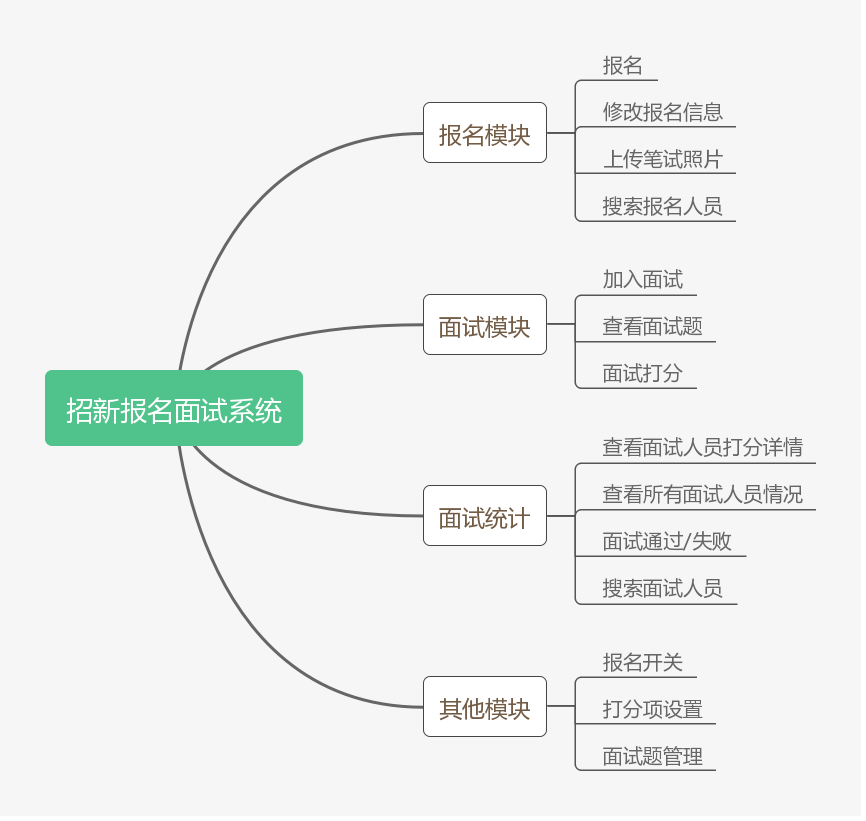
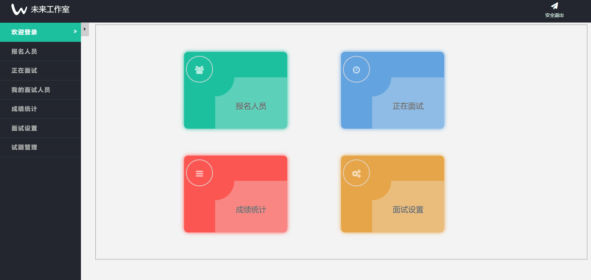
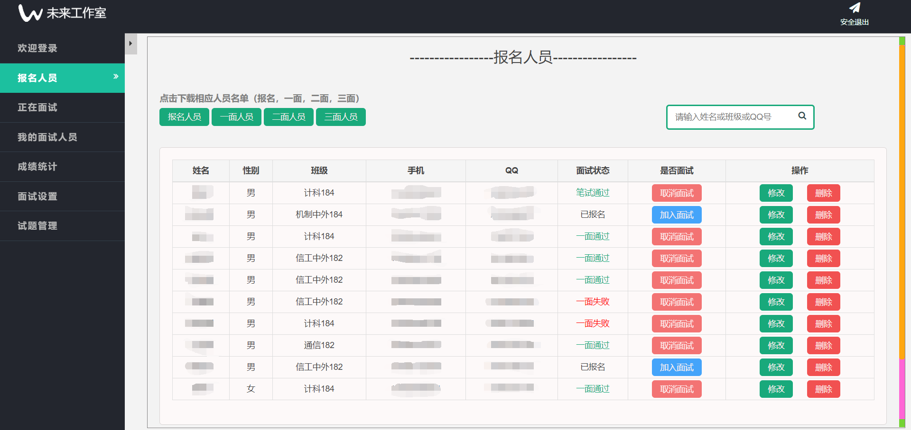
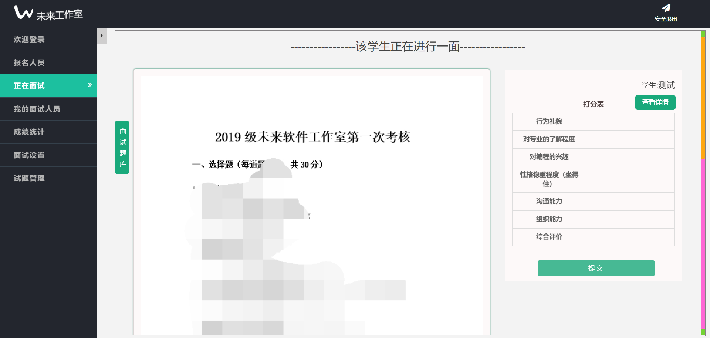
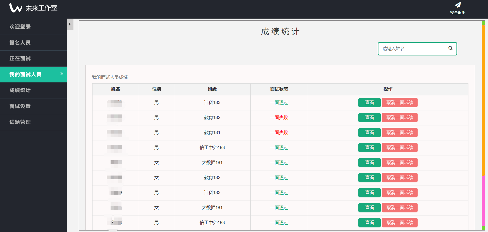
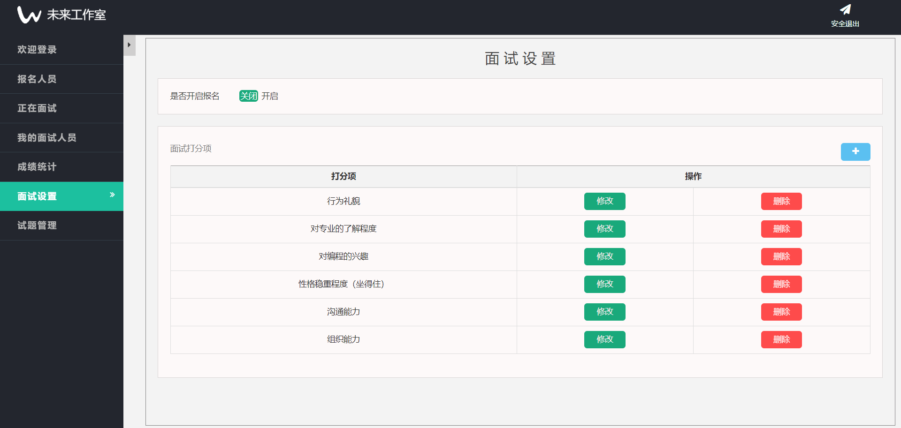

<h1 align="center">recruit</h1>

#### 项目介绍

未来软件工作室招新报名面试系统，用于工作室招新使用，主要功能有招新报名、上传笔试图片、查看面试题库、现场面试打分、查看打分结果，名单批量导出、题库管理等，极大方便了工作室招新面试相关事宜。

#### 模块介绍

#### 技术选型

|                           框架                            |         说明          | 版本  |
| :-------------------------------------------------------: | :-------------------: | :---: |
|   [Spring Boot](https://spring.io/projects/spring-boot)   |     应用开发框架      | 2.0.4 |
|            [MySQL](https://www.mysql.com/cn/)             |     数据库服务器      |  5.7  |
|         [Druid](https://github.com/alibaba/druid)         | JDBC 连接池、监控组件 | 1.1.9 |
| [MyBatis](http://www.mybatis.org/mybatis-3/zh/index.html) |    数据持久层框架     | 3.4.5 |
|         [MyBatis-Plus](https://mp.baomidou.com/)          |  Mybatis 增强工具包   | 2.1.8 |
|               [Poi](http://poi.apache.org/)               |     Office解析库      |  3.9  |
|          [Thymeleaf](https://www.thymeleaf.org/)          |  扩展性强的模板引擎   | 3.0.9 |

#### 部分页面展示

